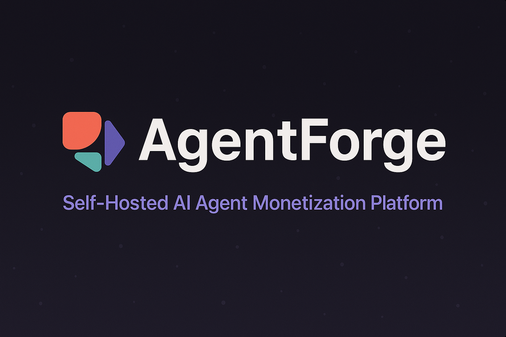
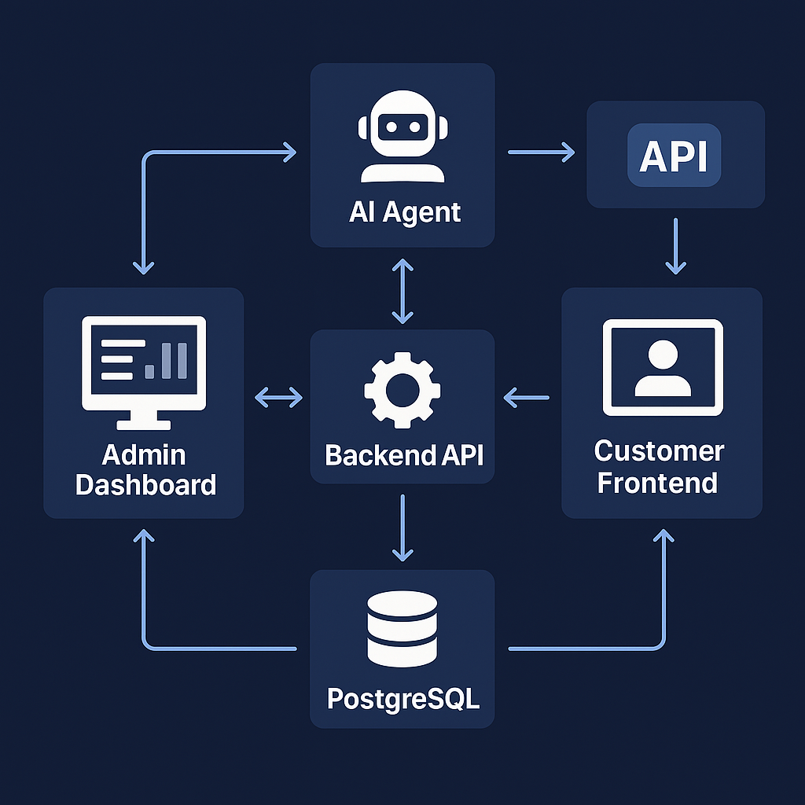

# 🚀 AgentForge – Self-Hosted AI Agent Monetization Platform

## 🧠 The Problem

AI agents are exploding in capability — but turning them into real businesses? Still a mess.  
Most devs struggle with brittle integrations, hosted platforms with lock-in, and zero control over data or monetization.  
If you're serious about deploying agents that talk, transact, and generate revenue — **you need infra that doesn't get in your way.**

---

### 💡 The Solution

**AgentForge** is your self-hosted command center for AI agents that *think*, *interact*, and *get paid*.  
No SaaS tax. No hidden limits. Just full control.

Built in 48 hours at Seoul BuildAI 2025, it's a drop-in framework for:

- 🔐 Hosting intelligent, tool-using agents with local persistence (PostgreSQL + Drizzle)
- 💬 Embedding chat UIs in any product or website
- 💸 Triggering and validating **on-chain payments** in the middle of conversations
- 🧩 Extending agents with custom tools (like fetching events or talking to APIs)
- 🛠️ Managing users, orgs, and workspaces via a clean admin UI

---

### 🧱 Key Features

- **Modular Multi-Tenant Architecture** (Org + Workspace based)
- **No vendor lock-in:** Only depends on your chosen LLM endpoint
- **Web3 native:** Uses forked version of Coinbase's `commerce-onchain-payment-protocol` that we deployed on **Rootstock**
- **Custom Agent Tools:** Payments, API integrations, whatever you can dream up
- **Built for builders:** Monorepo (pnpm), Bun runtime, Drizzle ORM, Shadcn UI
- **Zero-config local bootstrapping:** `pnpm i && pnpm run dev`

---

### 🔗 Tech Stack

- **Frontend:** Next.js (App Router), Tailwind CSS, shadcn/ui, Wagmi
- **Backend:** Hono, Bun, PostgreSQL, Drizzle ORM
- **AI:** AI SDK (@ai-sdk/react, @ai-sdk/google, etc)
- **Web3:** Foundry (Solidity), Viem, Coinbase payment protocol
- **Infra:** Docker, Railway, Neon Postgres, pnpm workspace

---

### 🧪 What's Working (Demo Highlights)

- Chat with AI agents → they ask for a payment → confirm with MetaMask → logged on-chain  
- Admin panel lets you create and monitor workspaces, users, and agent logs  
- Example agent tools already wired in (Payments + Ogrodje API)

---

### 🌱 What's Next

- Enhanced chat UX and payment status flows  
- Real-time dashboard for agent activity  
- More agent tools (e.g. Notion, Stripe, Discord bots)  
- Production-grade deployment boilerplate

---

## 🎯 Why This Matters

Open-source agent infra is still scattered, fragile, and tightly coupled to closed platforms.  
**AgentForge** offers an opinionated, production-ready blueprint for turning *any* agent into a business — fast.

It's not just a demo. It's a head start.

---

### ⚔️ Challenge for Judges
>
> If your AI agent **can't make money** or **integrate with your stack**, what's the point?

AgentForge doesn't just imagine that future — it builds it.
